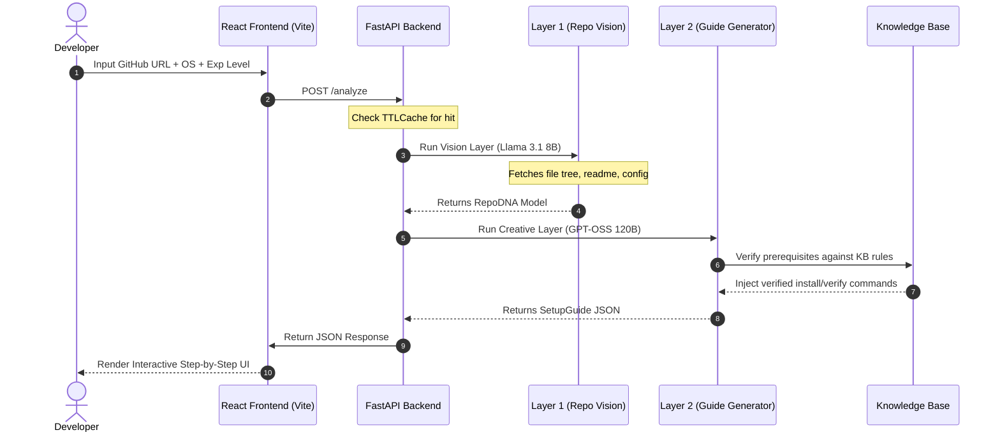

<div align="center">

# ⚡ REPONIFY

**Transform any public GitHub repository into a precise, step-by-step setup guide customized to your OS and experience level in seconds.**

[](https://fastapi.tiangolo.com)
[](https://react.dev)
[](https://vitejs.dev)
[](https://tailwindcss.com)
[](https://cerebras.ai)
[](https://python.org)

<p align="center">
  <a href="#-key-features">Key Features</a> •
  <a href="#-architecture--pipeline">AI Pipeline</a> •
  <a href="#-project-structure">Structure</a> •
  <a href="#-installation--setup">Setup Guide</a> •
  <a href="#-developer-profiles">Developer Profiles</a>
</p>

</div>

---

## 📸 Interactive UI Preview

```
┌────────────────────────────────────────────────────────────────────────────┐
│  ⚡ REPONIFY (Windows | Beginner)                                          │
├────────────────────────────────────────────────────────────────────────────┤
│  Enter Public GitHub URL: [ https://github.com/vercel/next.js           ]  │
│                                                                            │
│  [ Analyzing repository... ]                                               │
│  ◈ Layer 1: Extracting RepoDNA... [OK]                                     │
│  ◈ Layer 2: Designing setup guides... [OK]                                 │
│                                                                            │
├────────────────────────────────────────────────────────────────────────────┤
│  🚀 SETUP GUIDE FOR WINDOWS                                                │
│                                                                            │
│  Step 1: Install Node.js                                                   │
│  $ winget install OpenJS.NodeJS.LTS                                        │
│  └─ Explanation: Downloads and installs Node.js via Windows Package Manager.│
│                                                                            │
│  Step 2: Enter project folder                                              │
│  $ cd next.js                                                              │
│                                                                            │
│  Step 3: Run development server                                            │
│  $ npm run dev                                                             │
└────────────────────────────────────────────────────────────────────────────┘
```

---

## ⚡ Key Features

| Feature | Description | Technical Implementation |
| :--- | :--- | :--- |
| **🔑 Key Rotation** | Prevent rate limits & key exhaustion automatically. | Thread-safe `RoundRobinRotator` dynamically swaps keys on `429` or server errors. |
| **💻 OS-Aware Commands** | Generate exact commands matching the developer's environment. | Windows gets PowerShell/winget; macOS gets Homebrew; Linux gets apt/yum. |
| **🧠 Level Customization** | Adaptive content based on developer expertise. | Tailors explanations, safety checks, and commands from *Beginner* to *Advanced*. |
| **📦 Dependency Health** | Scans repository packages and scores compatibility health. | Pydantic validation mapping dependencies to health status models. |
| **💾 composite caching** | Zero-latency responses for popular repositories. | `TTLCache` with 1-hour TTL keyed by composite (URL + OS + Experience). |

---

## ⚙️ Architecture & Pipeline

Reponify coordinates a multi-layer pipeline utilizing **Cerebras Cloud SDK** for lightning-fast inference times.



---

## 📂 Project Structure

```yml
REPONIFY:
  # FastAPI Backend Service
  - main.py: FastAPI setup, CORS policies, health check, and endpoints
  - config.py: Configuration variables, environment, and token listings
  - models/
    - schemas.py: Data structure definitions (RepoDNA, SetupGuide, TechStackItem)
  - layers/
    - vision.py: Layer 1 logic (extracting metadata and raw readme commands)
    - creative.py: Layer 2 logic (writing personalized instructions)
  - utils/
    - key_manager.py: Thread-safe token rotator
    - cerebras.py: Cerebras API handler with auto context-limit truncation
    - github.py: GitHub API helper for repository assets and downloads
    - knowledge_base.py: Standardized installations and verification mappings

  # React 19 Frontend App
  - frontend/
    - src/
      - App.jsx: Main landing page, inputs, state, and spline animation mount
      - components/
        - ResultsDashboard.jsx: Displays step-by-step guides and health status
        - SettingsModal.jsx: Configures OS and Experience Level
        - LoadingState.jsx: Implements custom loading animations
      - index.css: Visual system tokens, background glows, and layout styles
```

---

## 👤 Developer Profiles

Our AI adapts language and instruction complexity to the developer's experience profile:

*   **🟢 Beginner Profile**
    *   Adds verification check steps (e.g. `node --version`).
    *   Plain English explanations for every command.
    *   Highlights what concept is learned at each stage.
*   **🟡 Intermediate Profile**
    *   Focuses exclusively on repository-specific commands.
    *   Skips basic package manager explanations.
*   **🔴 Advanced Profile**
    *   Returns raw shell commands.
    *   Zero prose, zero instructions, maximum density.

---

## 🚀 Installation & Setup

### 1. Prerequisites
Make sure you have:
* **Python 3.11+**
* **Node.js 18+**

### 2. Backend Setup
Activate a virtual environment, install package dependencies, and run the FastAPI server:

```bash
# Clone the repository
git clone https://github.com/SandipGhorai-max/NEW-REPONIFY.git
cd NEW-REPONIFY

# Create and activate virtual environment
python -m venv .venv
source .venv/bin/activate  # Windows: .venv\Scripts\activate

# Install requirements
pip install -r requirements.txt

# Create .env and update your API credentials
cp .env.example .env

# Run FastAPI backend
uvicorn main:app --reload --port 8000
```

### 3. Frontend Setup
Install npm packages and run Vite development server:

```bash
# Navigate to frontend folder
cd frontend

# Install package dependencies
npm install

# Build environment config
echo "VITE_API_URL=http://127.0.0.1:8000" > .env

# Run dev server
npm run dev
```

Open your browser at **`http://localhost:5173`** to access the dashboard.
