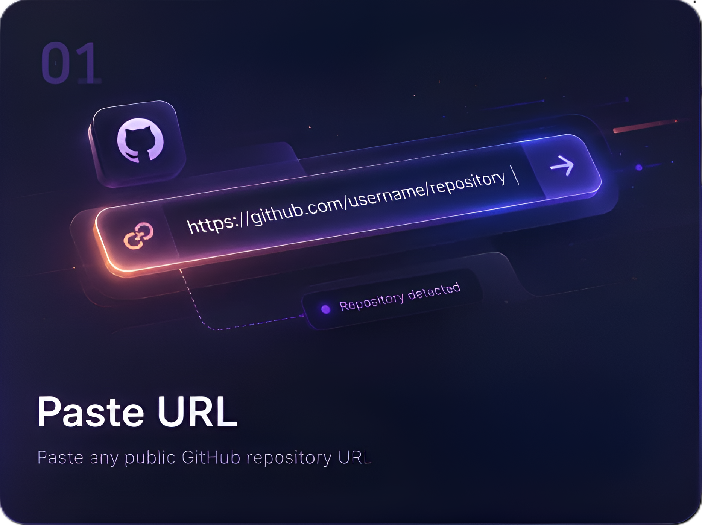
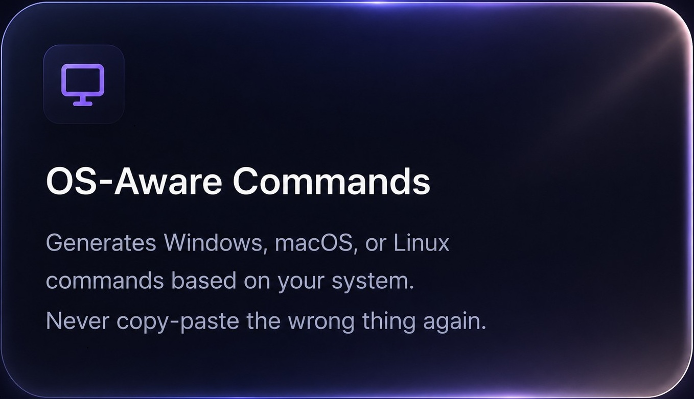
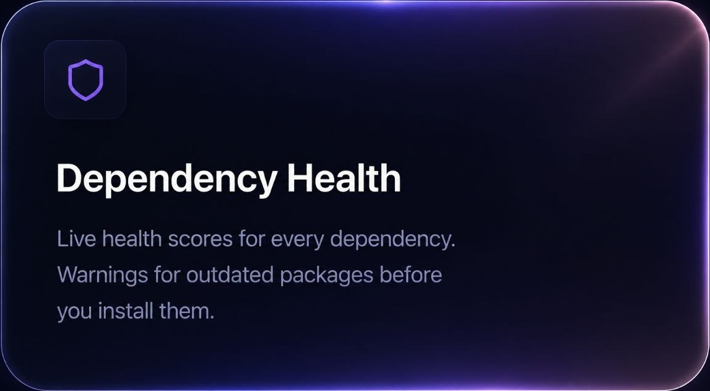
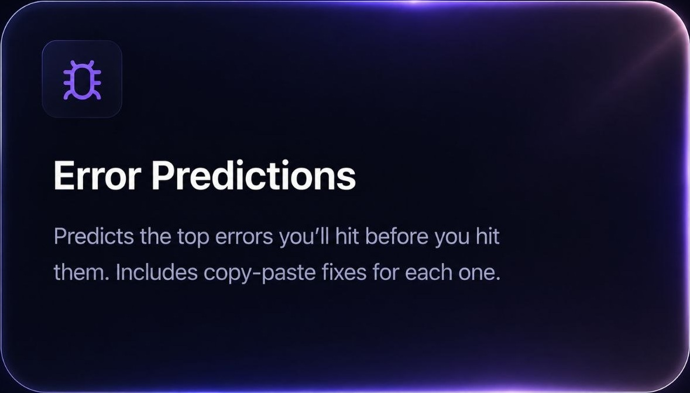
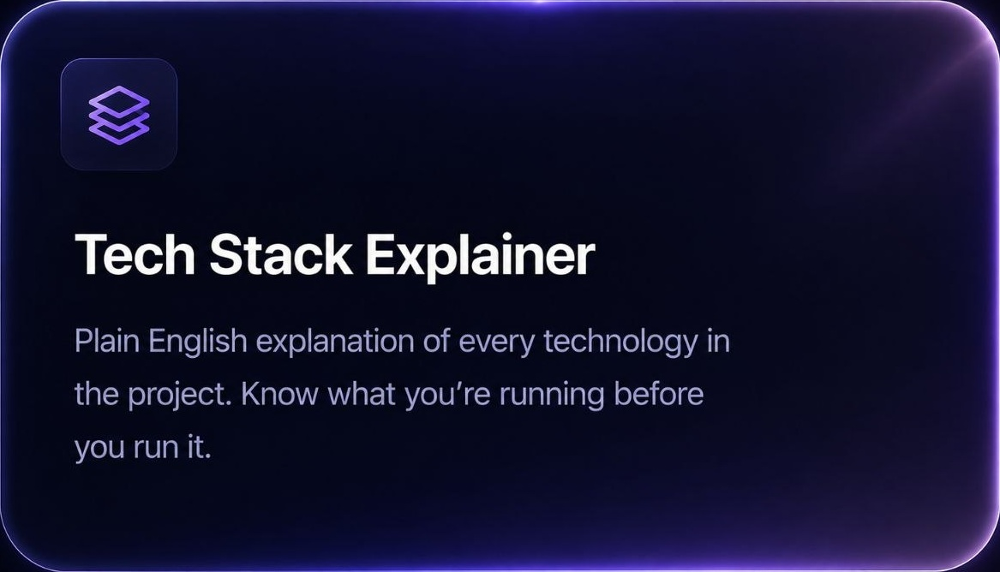
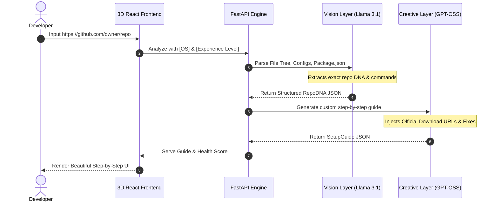

<div align="center">


# 

**Transform any public GitHub repository into a precise, step-by-step setup guide customized to your OS and experience level in seconds.**

<p align="center">
  
  
  
  
</p>

</div>


## 🚀 The Reponify Experience

*Reponify features a fully interactive 3D WebGL Spline model integrated seamlessly into a gorgeous, glassmorphic UI, ensuring that setting up projects feels like stepping into the future.*

<div align="center">
  
</div>


## 🌈 Visual Feature Showcase

We don't just generate text. We analyze the exact DNA of a repository and provide a stunning visual dashboard of its health, requirements, and commands.

<table align="center" width="100%" style="border-collapse: collapse; border: none;">
  <tr>
    <td width="50%" align="center" style="border: none;">
      
      <br><br><strong>💻 OS-Aware Commands</strong><br><sub>No more translating Linux instructions for Windows. Get exact `winget`, `brew`, or `apt` commands natively.</sub>
    </td>
    <td width="50%" align="center" style="border: none;">
      
      <br><br><strong>🏥 Dependency Health Checks</strong><br><sub>Visually score the health of the tech stack and flag deprecated packages before you even install them.</sub>
    </td>
  </tr>
  <tr>
    <td width="50%" align="center" style="border: none; padding-top: 20px;">
      
      <br><br><strong>⚠️ Predictive Error Fixing</strong><br><sub>Reponify anticipates common compilation and runtime errors for the stack, providing instant fixes.</sub>
    </td>
    <td width="50%" align="center" style="border: none; padding-top: 20px;">
      
      <br><br><strong>🧠 Tech Stack Explainer</strong><br><sub>Perfect for beginners: Plain-English explanations of every technology powering the repository.</sub>
    </td>
  </tr>
</table>


## ⚡ 4-Layer AI Pipeline

Under the hood, Reponify coordinates an ultra-fast **Cerebras Llama 3.1 8B** and **GPT-OSS 120B** LLM pipeline.




## 🌟 Developer Profiles

Customize the generated guide to match your exact expertise.

*   🔰 **Beginner**: Verbosely explains concepts, includes verification commands, and holds your hand.
*   🛠️ **Intermediate**: Focuses purely on project-specific steps with light assistance.
*   ⚡ **Advanced**: Zero prose. Maximum density. Just raw, actionable shell commands.


## 🛠️ Quick Start

### 1. Requirements
*  
* 

### 2. Run the FastAPI Backend
```bash
# Clone & enter folder
git clone https://github.com/SandipGhorai-max/NEW-REPONIFY.git
cd NEW-REPONIFY

# Setup Python environment
python -m venv .venv
source .venv/bin/activate  # Windows: .venv\Scripts\activate
pip install -r requirements.txt

# Setup credentials
cp .env.example .env
# --> Edit .env with your Cerebras & GitHub tokens! <--

# Launch server
uvicorn main:app --reload --port 8000
```

### 3. Launch the 3D Frontend
```bash
cd frontend
npm install

# Connect to backend
echo "VITE_API_URL=http://127.0.0.1:8000" > .env

# Start dev server
npm run dev
```
> 🎉 **Navigate to `http://localhost:5173` to see it in action!**

<br>

<div align="center">
  <sub>Built with ❤️ for developers who just want their projects to run.</sub>
</div>
